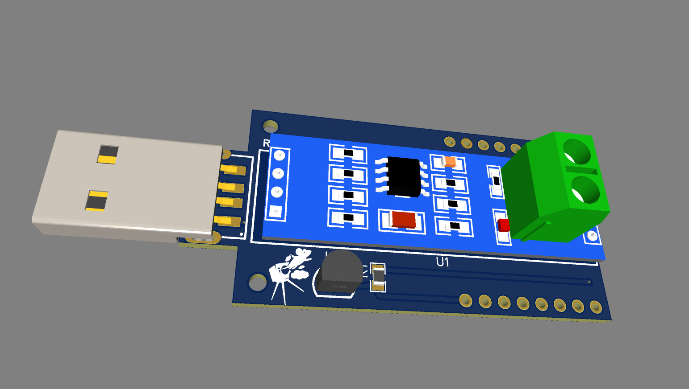
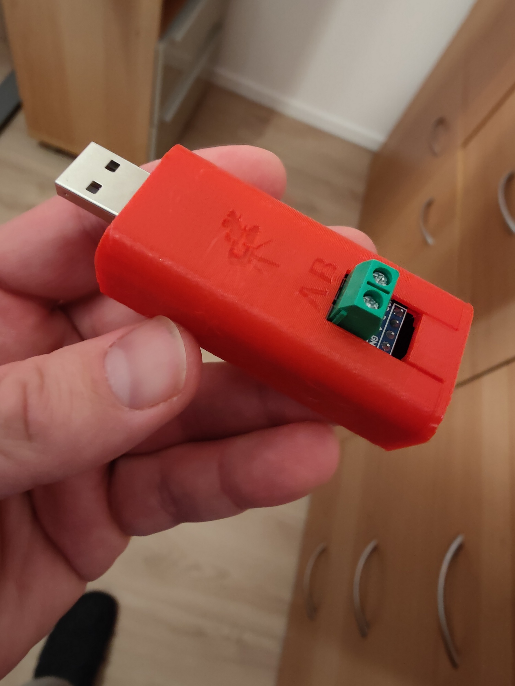
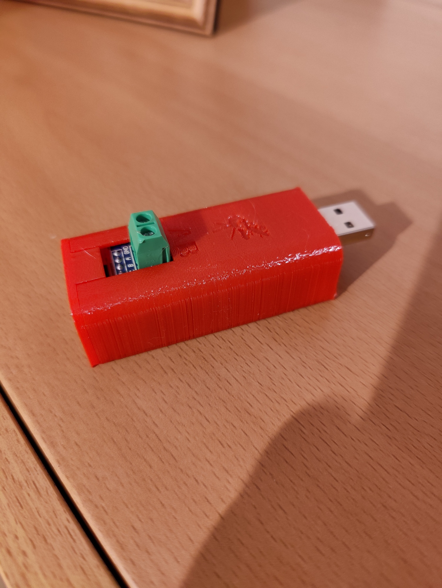
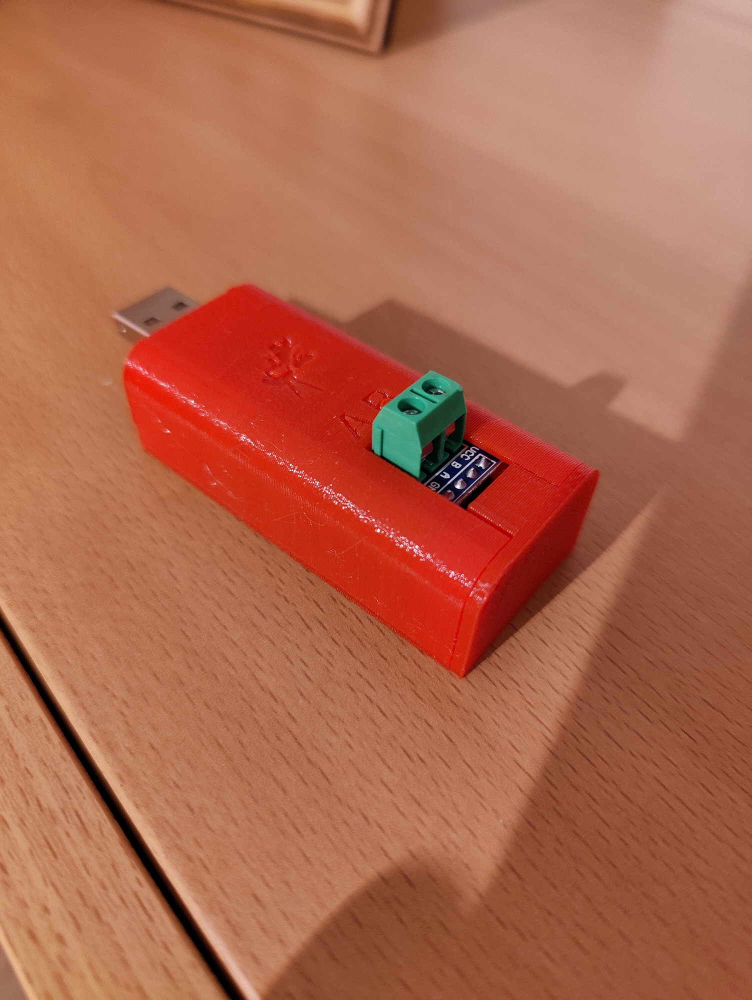
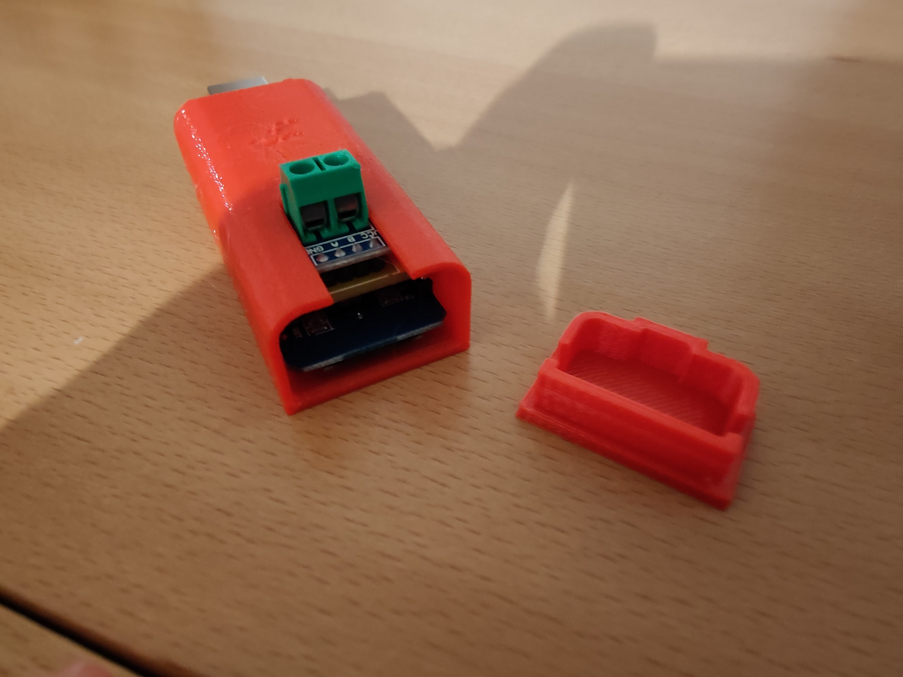

# USB_Dongle_ESP8266_Max485

There is a USB dongle with the Max485 Modbus controller for the inverter Growatt

The main idea was to find a solution for Growatt inverter to read the values. The simple solution is almost always the best solution, this has determined my way.

Growatt has a USB interface which is intended for the USB dongle Shine. In itself, the original solution is almost unusable, because very slow response times, often no connection to the cloud. The desire was to have everything locally and almost in real time to read the values. 

This dongle is plugged into the USB socket of Growatt and the outputs of ModBus 3 and 4 are connected to the connectors on the dongle A and B.
When Growatt produces the current, it also supplies the dongle and sends the corresponding values

The main part is solved by ESPHome. The configuration file is included in the repository. Quite commonly flash Wemos D1 Mini with ESPHome, customize the config for yourself. 

#Images

